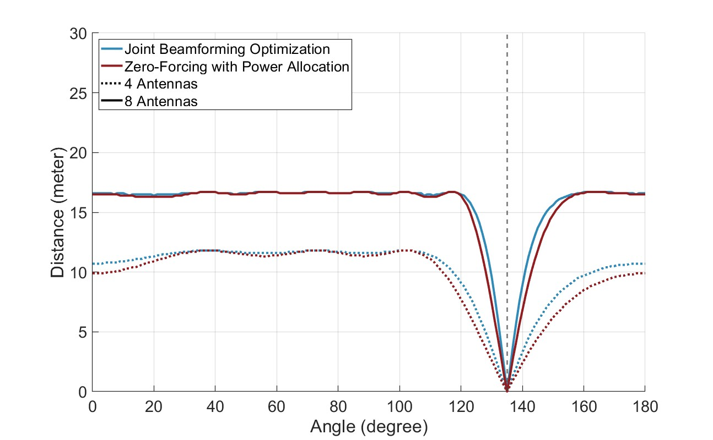
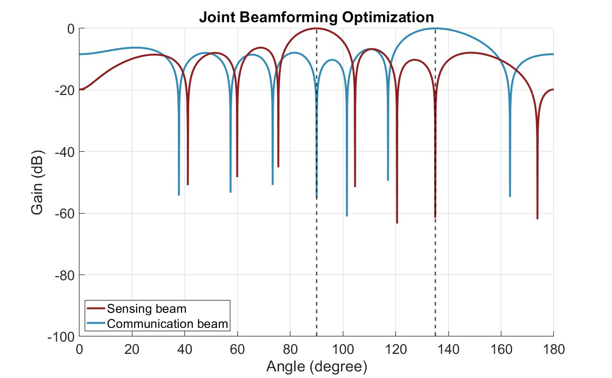

# ISAC with Backscattering RFID Tags: Joint Beamforming Design
This is a MATLAB code package related to the following article: "[ISAC with Backscattering RFID Tags: Joint Beamforming Design](https://arxiv.org/abs/2401.09761)", accepted to the IEEE International Conference on Communication (ICC), 2024.

# Abstract of the Article
In this paper, we explore an integrated sensing and communication (ISAC) system with backscattering RFID tags. In this setup, an access point employs a communication beam to serve a user while leveraging a sensing beam to detect an RFID tag. Under the total transmit power constraint of the system, our objective is to design sensing and communication beams by considering the tag detection and communication requirements. First, we adopt zero-forcing to design the beamforming vectors, followed by solving a convex optimization problem to determine the power allocation between sensing and communication. Then, we study a joint beamforming design problem with the goal of minimizing the total transmit power while satisfying the tag detection and communication requirements. To resolve this, we re-formulate the non-convex constraints into convex second-order cone constraints. The simulation results demonstrate that, under different communication SINR requirements, joint beamforming optimization outperforms the zero-forcing-based method in terms of achievable detection distance, offering a promising approach for the ISAC-backscattering systems.

# Code Package Content
- The simulation parameters can be set in `sim_params.m` file.

**Max detection distance**
- Run `run_max_distance.m` to generate the results.
- Run `plot_max_distance.m` to plot the figure.

**Beamforming pattern**
- Run `plot_beam_pattern.m` to generate the figure.
- The angles of the tag and the user can be set in this file.

If you have any questions regarding the code, please contact [Hao Luo](mailto:h.luo@asu.edu).

# License and Referencing
This code package is licensed under a[ Creative Commons Attribution-NonCommercial-ShareAlike 4.0 International License](https://creativecommons.org/licenses/by-nc-sa/4.0/). If you in any way use this code for research that results in publications, please cite our original article:
> H. Luo, U. Demirhan, and A. Alkhateeb, "ISAC with Backscattering RFID Tags: Joint Beamforming Design," arXiv preprint arXiv:2401.09761, 2024.
